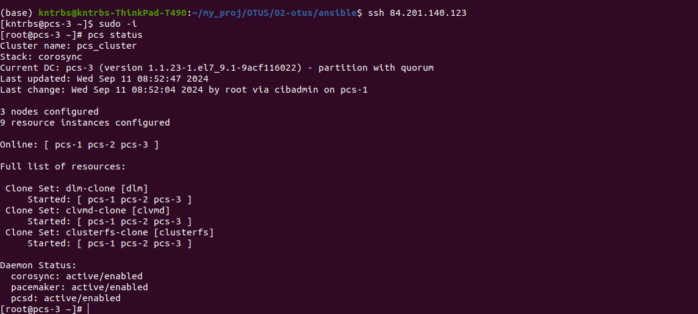
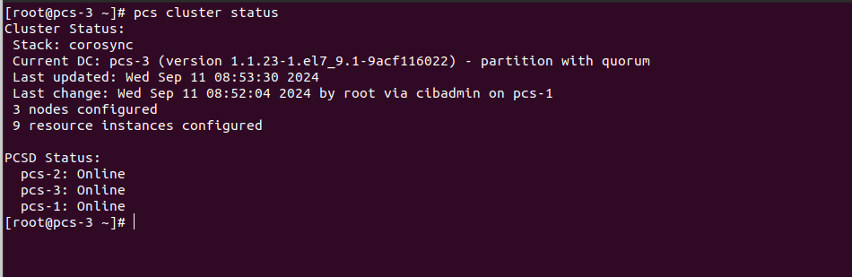
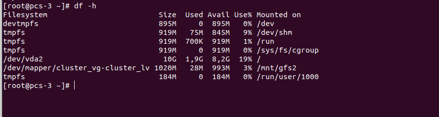
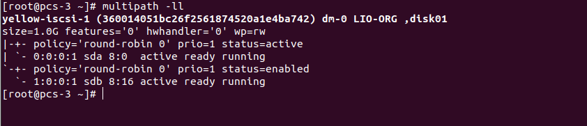
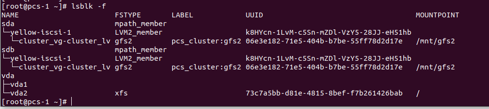

Домашнее задание
Реализация GFS2 хранилища на виртуалках под виртуалбокс

Цель:
развернуть в Yandex Cloud следующую конфигурацию с помощью terraform

1 виртуалка с iscsi
3 виртуальные машины с разделяемой файловой системой GFS2 поверх cLVM

Привести к рабочему виду файл variables.tf, внеся в него данные от своего аккаунта Yandex Cloud, а также изменить имя пользователя
Привести к необходимому виду файл cloud-init.yml, внеся в него ваш открытый ssh ключ, а также имя вашего пользователя
Добавить пользователя в файл ansible.cfg

terraform apply -auto-approve

Переходим в папку ansible  и запускаем плейбук

ansible-playbook main.yml -e ntp_timezone=Europe/Moscow -e "newpassword=qwerty12345"

------------------------------------------------------------------------
После успешной настройки можно увидить состояние кластера:

Здесь мы видим что успешно примонтирована файловая система GFS2:

Далее мы можем посмотреть что у нас есть связь с ISCSI хостом, на котором располагается хранилище:

Можем увидеть структуру наших блочных устройств:

