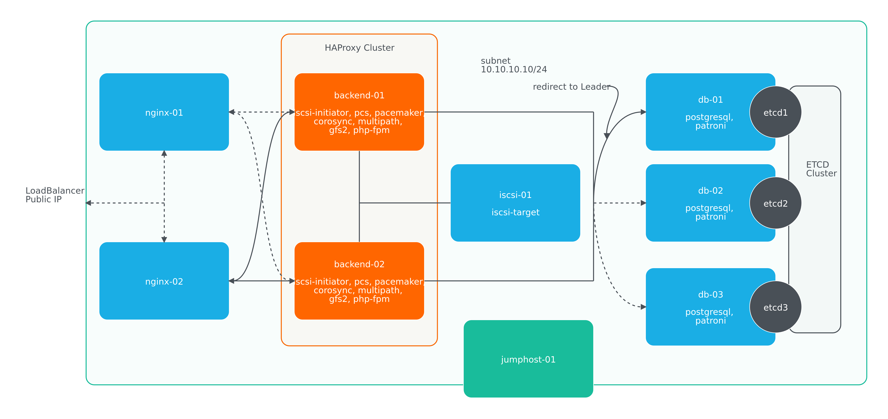
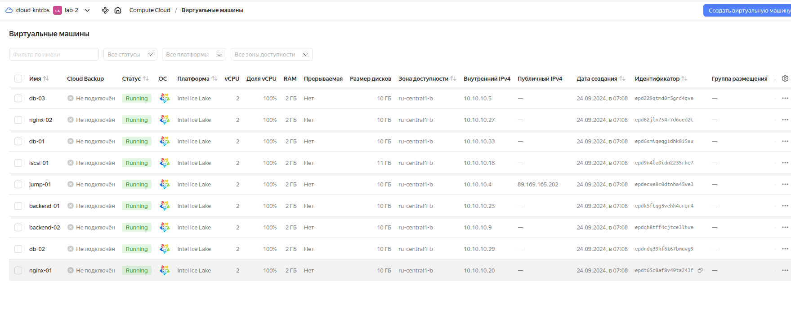
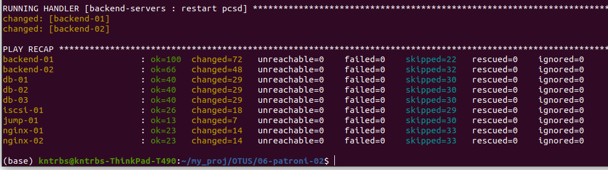
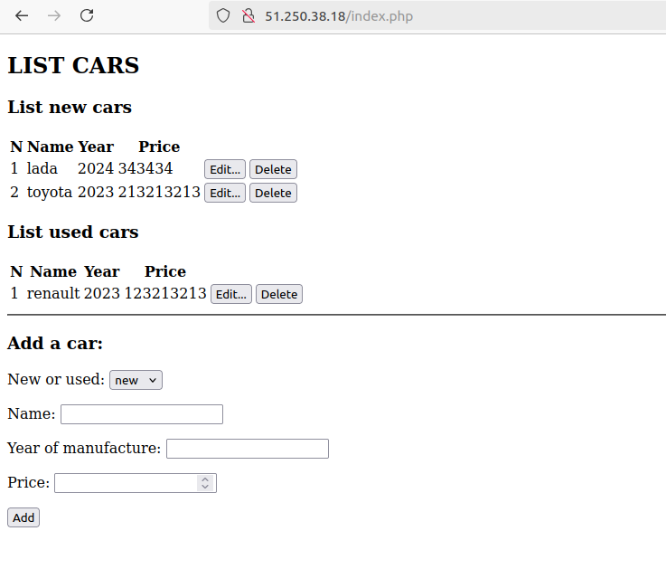
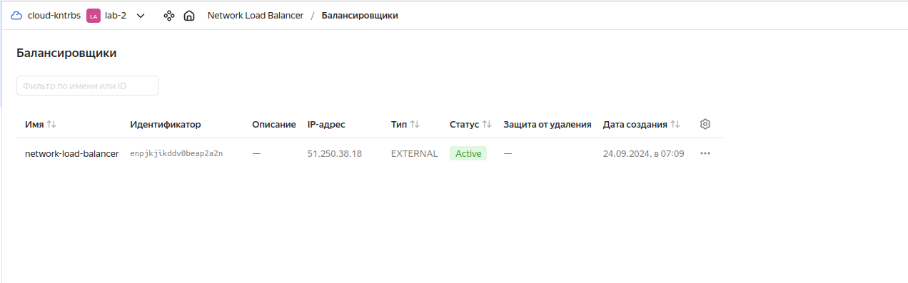
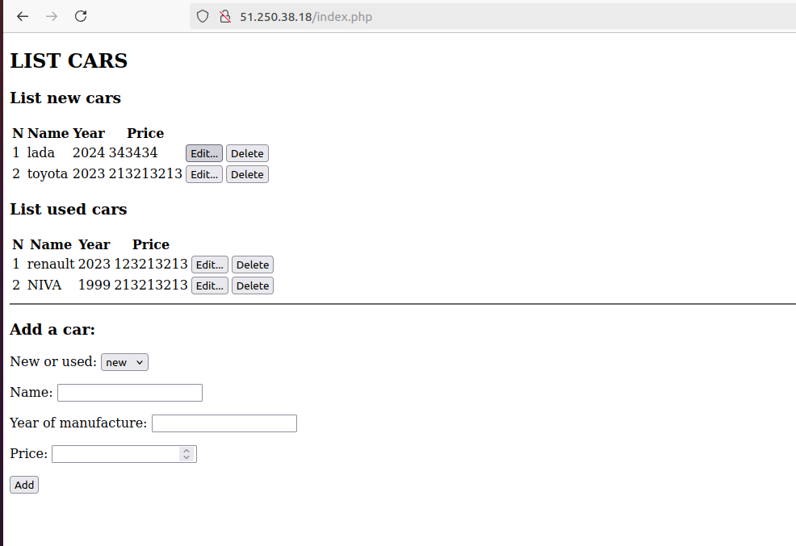
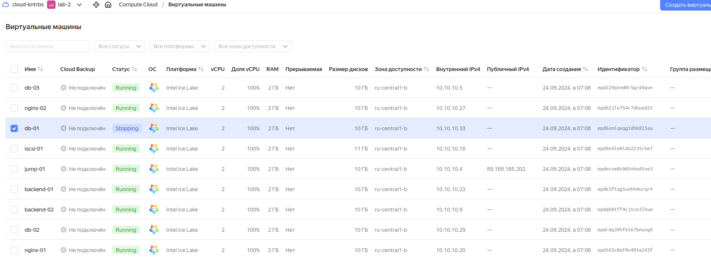
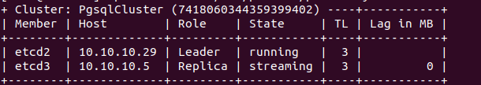
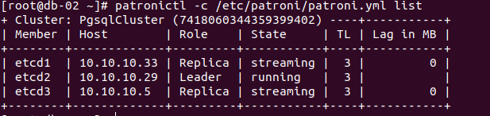

# lab-06
otus | postresql cluster

### Домашнее задание
реализация кластера postgreSQL с помощью patroni

#### Цель:
Перевести БД веб проекта на кластер postgreSQL с ипользованием patroni, etcd/consul/zookeeper и haproxy/pgbouncer

### Выполнение домашнего задания

#### Создание стенда

Стенд будем разворачивать с помощью Terraform на YandexCloud, настройку серверов будем выполнять с помощью Ansible.

Схема:



Для начала получаем OAUTH токен:
```
https://cloud.yandex.ru/docs/iam/concepts/authorization/oauth-token
```
Настраиваем аутентификации в консоли:
```
export YC_TOKEN=$(yc iam create-token)
export TF_VAR_yc_token=$YC_TOKEN
```
В файле provider.tf нужно вставить свой 'cloud_id':
```
cloud_id  = "..."
```

При необходимости в файле main.tf вставить нужные 'ssh_public_key' и 'ssh_private_key', так как по умолчанию соответсвенно id_rsa.pub и id_rsa:
```
ssh_public_key  = "~/.ssh/id_rsa.pub"
ssh_private_key = "~/.ssh/id_rsa"
```

Для того чтобы развернуть стенд, нужно выполнить следующую команду:
```
terraform init && terraform apply -auto-approve && \
sleep 60 && ansible-playbook ./provision.yml
```
По завершению команды получим данные outputs:
```
Apply complete! Resources: 20 added, 0 changed, 0 destroyed.

Outputs:

backend-servers-info = {
  "backend-01" = {
    "ip_address" = tolist([
      "10.10.10.23",
    ])
    "nat_ip_address" = tolist([
      "",
    ])
  }
  "backend-02" = {
    "ip_address" = tolist([
      "10.10.10.9",
    ])
    "nat_ip_address" = tolist([
      "",
    ])
  }
}
db-servers-info = {
  "db-01" = {
    "ip_address" = tolist([
      "10.10.10.33",
    ])
    "nat_ip_address" = tolist([
      "",
    ])
  }
  "db-02" = {
    "ip_address" = tolist([
      "10.10.10.29",
    ])
    "nat_ip_address" = tolist([
      "",
    ])
  }
  "db-03" = {
    "ip_address" = tolist([
      "10.10.10.5",
    ])
    "nat_ip_address" = tolist([
      "",
    ])
  }
}
iscsi-servers-info = {
  "iscsi-01" = {
    "ip_address" = tolist([
      "10.10.10.18",
    ])
    "nat_ip_address" = tolist([
      "",
    ])
  }
}
jump-servers-info = {
  "jump-01" = {
    "ip_address" = tolist([
      "10.10.10.4",
    ])
    "nat_ip_address" = tolist([
      "89.169.165.202",
    ])
  }
}
loadbalancer-info = toset([
  {
    "external_address_spec" = toset([
      {
        "address" = "51.250.38.18"
        "ip_version" = "ipv4"
      },
    ])
    "internal_address_spec" = toset([])
    "name" = "http-listener"
    "port" = 80
    "protocol" = "tcp"
    "target_port" = 80
  },
])
nginx-servers-info = {
  "nginx-01" = {
    "ip_address" = tolist([
      "10.10.10.20",
    ])
    "nat_ip_address" = tolist([
      "",
    ])
  }
  "nginx-02" = {
    "ip_address" = tolist([
      "10.10.10.27",
    ])
    "nat_ip_address" = tolist([
      "",
    ])
  }
}

```

На всех серверах будут установлены ОС Almalinux 8, настроены смнхронизация времени Chrony, система принудительного контроля доступа SELinux, в качестве firewall будет использоваться NFTables.

Стенд был взят из лабораторной работы 3, только вместо одного сервера для базы данных, будет кластер, состоящий из серверов db-01, db-02 и db-03. Для создания кластера базы данных будем использовать кластер PostgreSQL с ипользованием Patroni, ETCD и HAProxy.

Так как на YandexCloud ограничено количество выделяемых публичных IP адресов, в дополнение к этому стенду создадим ещё один сервер jump-01 в качестве JumpHost, через который будем подключаться по SSH (в частности для Ansible) к другим серверам той же подсети.

Список виртуальных машин после запуска стенда:




С помощью ssh через jump-сервер jump-01 подключися к какому-либо сервера PostgreSQL кластера, например, db-02:
```
ssh -J almalinux@89.169.165.202 almalinux@10.10.10.29
```

Посмотрим конфиги кластера:
```
[root@db-02 ~]# grep -v '^$\|^\s*\#' /etc/etcd/etcd.conf
```
```
ETCD_NAME=etcd2
ETCD_DATA_DIR="/var/lib/etcd"
ETCD_HEARTBEAT_INTERVAL="100"
ETCD_ELECTION_TIMEOUT="5000"
ETCD_LISTEN_PEER_URLS="http://0.0.0.0:2380"
ETCD_LISTEN_CLIENT_URLS="http://0.0.0.0:2379"
ETCD_INITIAL_ADVERTISE_PEER_URLS="http://10.10.10.29:2380"
ETCD_INITIAL_CLUSTER="etcd1=http://10.10.10.33:2380,etcd2=http://10.10.10.29:2380,etcd3=http://10.10.10.5:2380"
ETCD_INITIAL_CLUSTER_STATE="new"
ETCD_INITIAL_CLUSTER_TOKEN="PgsqlCluster"
ETCD_ADVERTISE_CLIENT_URLS="http://10.10.10.29:2379"
ETCD_ENABLE_V2="true"

```

```
etcdctl endpoint status --write-out=table --endpoints=10.10.10.33:2379,10.10.10.5:2379,10.10.10.29:2379
```
```
+------------------+------------------+---------+---------+-----------+------------+-----------+------------+--------------------+--------+
|     ENDPOINT     |        ID        | VERSION | DB SIZE | IS LEADER | IS LEARNER | RAFT TERM | RAFT INDEX | RAFT APPLIED INDEX | ERRORS |
+------------------+------------------+---------+---------+-----------+------------+-----------+------------+--------------------+--------+
| 10.10.10.33:2379 | 6b4cc62519a4b55b |  3.5.15 |   20 kB |      true |      false |         2 |       2493 |               2493 |        |
|  10.10.10.5:2379 | 849d4c7b9b59ba24 |  3.5.15 |   20 kB |     false |      false |         2 |       2493 |               2493 |        |
| 10.10.10.29:2379 |  547bbb6bdc1ee02 |  3.5.15 |   20 kB |     false |      false |         2 |       2493 |               2493 |        |
+------------------+------------------+---------+---------+-----------+------------+-----------+------------+--------------------+--------+

```

Конфигурация Patroni:
```
grep -v '^$\|^\s*\#' /etc/patroni/patroni.yml 
```
```
scope: PgsqlCluster
name: etcd2
restapi:
  listen: 10.10.10.29:8008
  connect_address: 10.10.10.29:8008
etcd:
  hosts: 10.10.10.33:2379,10.10.10.29:2379,10.10.10.5:2379
bootstrap:
  dcs:
    ttl: 30
    loop_wait: 10
    retry_timeout: 10
    maximum_lag_on_failover: 1048576
    postgresql:
      use_pg_rewind: true
      pg_hba:
      - host replication replicator 127.0.0.1/32 md5
      - host replication replicator 10.10.10.5/0 md5
      - host replication replicator 10.10.10.29/0 md5
      - host replication replicator 10.10.10.33/0 md5
      - host all all 0.0.0.0/0 md5
      parameters:
  initdb:  # Note: It needs to be a list (some options need values, others are switches)
  - encoding: UTF8
  - data-checksums
postgresql:
  listen: 10.10.10.29:5432
  connect_address: 10.10.10.29:5432
  data_dir: /var/lib/pgsql/16/data
  bin_dir: /usr/pgsql-16/bin/
  pgpass: /tmp/pgpass0
  authentication:
    replication:
      username: replicator
      password: rep-pass
    superuser:
      username: postgres
      password: patroni
    rewind:  # Has no effect on postgres 10 and lower
      username: rewind_user
      password: rewind_password
  parameters:
    unix_socket_directories: '..'  # parent directory of data_dir
tags:
    noloadbalance: false
    clonefrom: false
    nosync: false
    nostream: false

```

```
patronictl -c /etc/patroni/patroni.yml list
```
```
+ Cluster: PgsqlCluster (7418060344359399402) ----+-----------+
| Member | Host        | Role    | State     | TL | Lag in MB |
+--------+-------------+---------+-----------+----+-----------+
| etcd1  | 10.10.10.33 | Replica | streaming |  1 |         0 |
| etcd2  | 10.10.10.29 | Replica | streaming |  1 |         0 |
| etcd3  | 10.10.10.5  | Leader  | running   |  1 |           |
+--------+-------------+---------+-----------+----+-----------+

```

Как видим, мастером является хост с IP адресом 10.10.10.5, то есть сервер db-03.

Следующей командой мы можем вручную переключить режим мастера на другой хост, например, db-01 с IP адресом 10.10.10.33:
```
patronictl -c /etc/patroni/patroni.yml switchover
```
```
Current cluster topology
+ Cluster: PgsqlCluster (7418060344359399402) ----+-----------+
| Member | Host        | Role    | State     | TL | Lag in MB |
+--------+-------------+---------+-----------+----+-----------+
| etcd1  | 10.10.10.33 | Replica | streaming |  1 |         0 |
| etcd2  | 10.10.10.29 | Replica | streaming |  1 |         0 |
| etcd3  | 10.10.10.5  | Leader  | running   |  1 |           |
+--------+-------------+---------+-----------+----+-----------+
Primary [etcd3]: 
Candidate ['etcd1', 'etcd2'] []: etcd1
When should the switchover take place (e.g. 2024-09-24T08:44 )  [now]: 
Are you sure you want to switchover cluster PgsqlCluster, demoting current leader etcd3? [y/N]: y
2024-09-24 07:44:34.74989 Successfully switched over to "etcd1"
+ Cluster: PgsqlCluster (7418060344359399402) ----+-----------+
| Member | Host        | Role    | State     | TL | Lag in MB |
+--------+-------------+---------+-----------+----+-----------+
| etcd1  | 10.10.10.33 | Leader  | running   |  1 |           |
| etcd2  | 10.10.10.29 | Replica | streaming |  1 |         0 |
| etcd3  | 10.10.10.5  | Replica | stopped   |    |   unknown |
+--------+-------------+---------+-----------+----+-----------+

```

Снова проверим:
```
patronictl -c /etc/patroni/patroni.yml list
```
```
+ Cluster: PgsqlCluster (7418060344359399402) ----+-----------+
| Member | Host        | Role    | State     | TL | Lag in MB |
+--------+-------------+---------+-----------+----+-----------+
| etcd1  | 10.10.10.33 | Leader  | running   |  2 |           |
| etcd2  | 10.10.10.29 | Replica | streaming |  2 |         0 |
| etcd3  | 10.10.10.5  | Replica | streaming |  2 |         0 |
+--------+-------------+---------+-----------+----+-----------+

```

Как видим, мастером стал хост с IP адресом 10.10.10.33, то есть сервер db-01.

Для проверки работы стенда воспользуемся отображением простой страницы собственноручно созданного сайта на PHP, 
имитирующий продажу новых и подержанных автомобилей:



Значение IP адреса сайта получен от балансировщика от YandexCloud:



При напонении сайта данные будут размещаться в базе данных кластера серверов db-01, db-02, db-03. На данном кластере, как и ранее заявлялось, установлены приложения PostgreSQL, Patroni, etcd.
Заранее создана база данных 'cars', в котором созданы таблицы 'new' и 'used', имитирующие списки соответственно новых и подержанных автомобилей.

Начнём наполнять этот сайт:



Сайт наполняется, серверы работают пока корректно.

Отключим одну виртуальную машину из кластера, например, db-01 (первый возможный вариант):





Обновим страницу:

Продолжим наполнять сайт:

Как видим, сайт работает с отключенным сервером db-01.

Запускаем db-01 :


Метод проверки показал, что при отключенных нодах кластера сайт работает. 

#### Удаление стенда

Удалить развернутый стенд командой:
```
terraform destroy -auto-approve
```
### Из замечаний
Нужно следить за обновлением ключей репозиториев Almalinux
Так же использовать последний image на настоящее время
Возможно поменяется ssh юзер