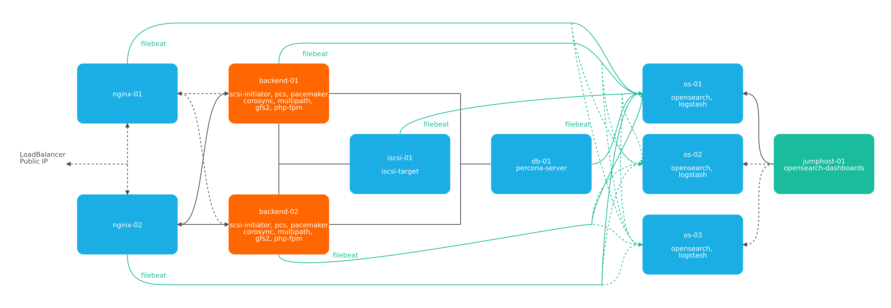
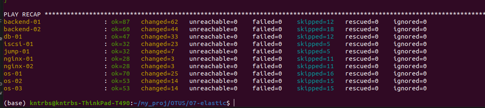
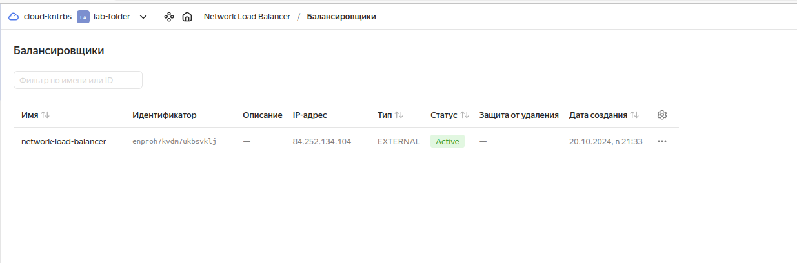
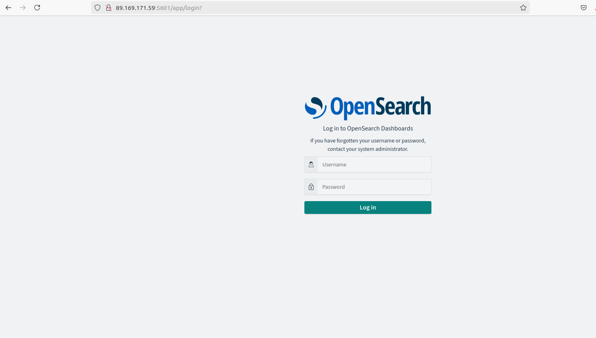
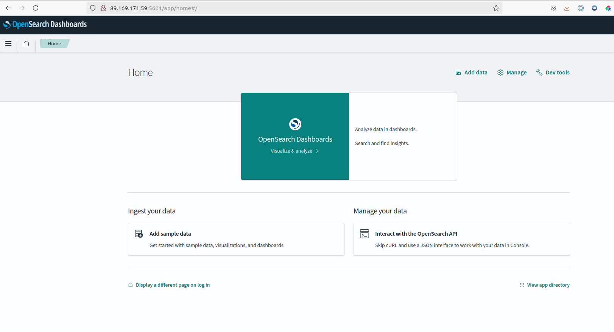
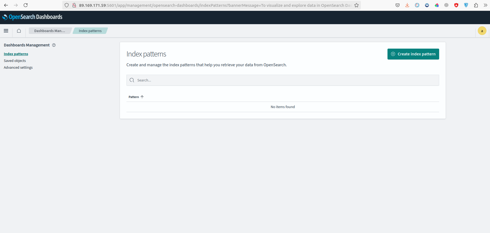
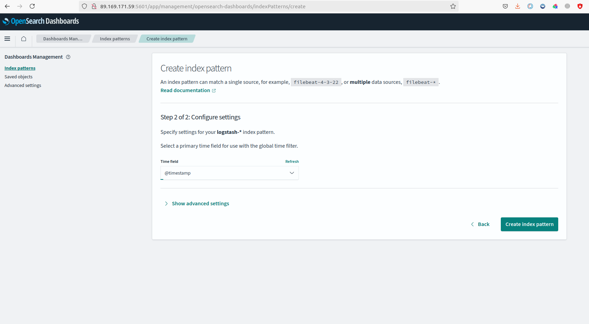
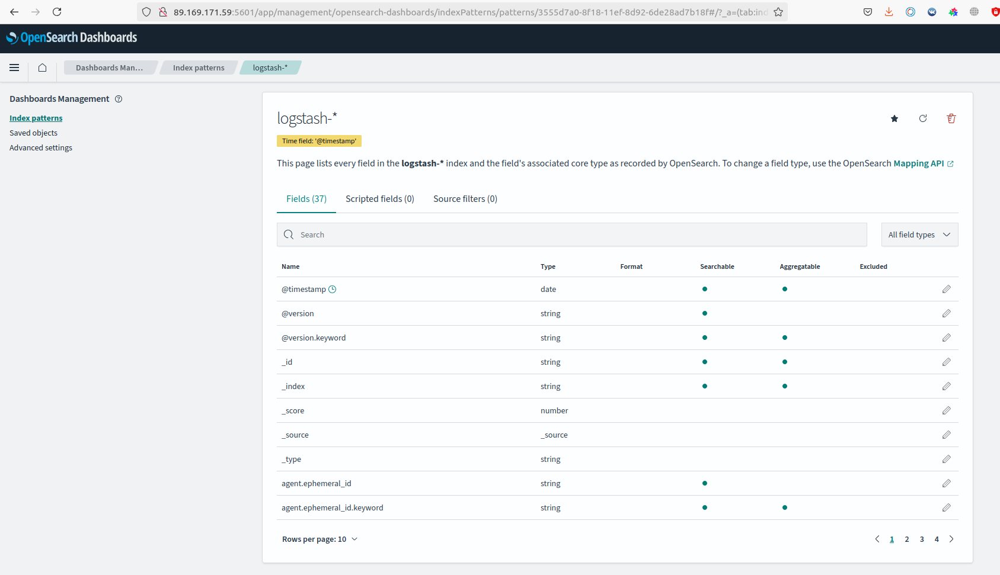
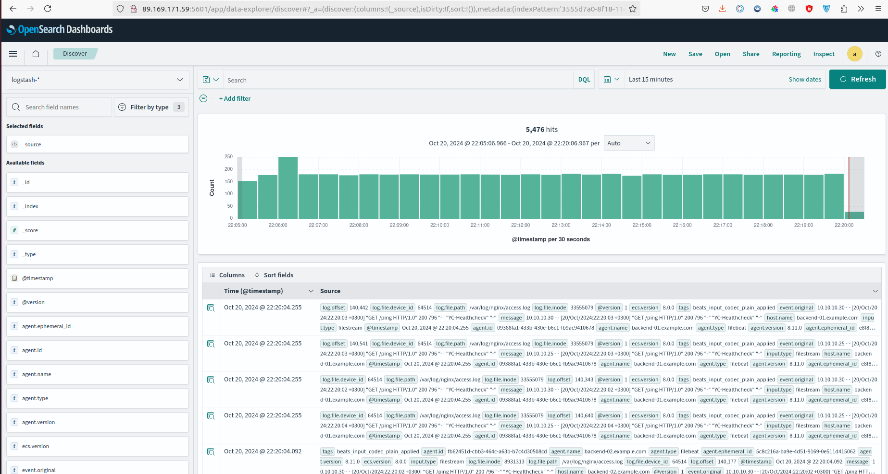

# lab-07
otus | elasticsearch (opensearch) cluster

### Домашнее задание
Настроить централизорованный сбор логов в кластер elasticsearch

#### Цель:
1. Развернуть кластер elasticsearch (минимум 3 вм)
2. Настроить сбор логов со всех серверов проекта (веб-сервера, балансеры, базы данных)


### Выполнение домашнего задания

#### Создание стенда

Стенд будем разворачивать с помощью Terraform на YandexCloud, настройку серверов будем выполнять с помощью Ansible.

Схема:



Для начала получаем OAUTH токен:
```
https://cloud.yandex.ru/docs/iam/concepts/authorization/oauth-token
```

Настраиваем аутентификации в консоли:
```
export YC_TOKEN=$(yc iam create-token)
export TF_VAR_yc_token=$YC_TOKEN
```

В файле provider.tf нужно вставить свой 'cloud_id':
```
cloud_id  = "..."
```

При необходимости в файле main.tf вставить нужные 'ssh_public_key' и 'ssh_private_key', так как по умолчанию соответсвенно id_rsa.pub и id_rsa:
```
ssh_public_key  = "~/.ssh/id_rsa.pub"
ssh_private_key = "~/.ssh/id_rsa"
```

Для того чтобы развернуть стенд, развертываем вм на yandex-cloud:
```
terraform init && terraform apply -auto-approve 
```

По завершению команды получим данные outputs:
```
Outputs:

backend-servers-info = {
  "backend-01" = {
    "ip_address" = tolist([
      "10.10.10.9",
    ])
    "nat_ip_address" = tolist([
      "",
    ])
  }
  "backend-02" = {
    "ip_address" = tolist([
      "10.10.10.40",
    ])
    "nat_ip_address" = tolist([
      "",
    ])
  }
}
db-servers-info = {
  "db-01" = {
    "ip_address" = tolist([
      "10.10.10.16",
    ])
    "nat_ip_address" = tolist([
      "",
    ])
  }
}
iscsi-servers-info = {
  "iscsi-01" = {
    "ip_address" = tolist([
      "10.10.10.35",
    ])
    "nat_ip_address" = tolist([
      "",
    ])
  }
}
jump-servers-info = {
  "jump-01" = {
    "ip_address" = tolist([
      "10.10.10.5",
    ])
    "nat_ip_address" = tolist([
      "89.169.171.59",
    ])
  }
}
loadbalancer-info = toset([
  {
    "external_address_spec" = toset([
      {
        "address" = "84.252.134.104"
        "ip_version" = "ipv4"
      },
    ])
    "internal_address_spec" = toset([])
    "name" = "http-listener"
    "port" = 80
    "protocol" = "tcp"
    "target_port" = 80
  },
])
nginx-servers-info = {
  "nginx-01" = {
    "ip_address" = tolist([
      "10.10.10.25",
    ])
    "nat_ip_address" = tolist([
      "",
    ])
  }
  "nginx-02" = {
    "ip_address" = tolist([
      "10.10.10.30",
    ])
    "nat_ip_address" = tolist([
      "",
    ])
  }
}
os-servers-info = {
  "os-01" = {
    "ip_address" = tolist([
      "10.10.10.21",
    ])
    "nat_ip_address" = tolist([
      "",
    ])
  }
  "os-02" = {
    "ip_address" = tolist([
      "10.10.10.22",
    ])
    "nat_ip_address" = tolist([
      "",
    ])
  }
  "os-03" = {
    "ip_address" = tolist([
      "10.10.10.26",
    ])
    "nat_ip_address" = tolist([
      "",
    ])
  }
}
```

На всех серверах будут установлены ОС Almalinux 8, настроены смнхронизация времени Chrony, система принудительного контроля доступа SELinux, в качестве firewall будет использоваться NFTables.

Для централизованного сбора логов со всех серверов данного стенда создадим OpenSearch кластер, состоящий из серверов os-01, os-02 и os-03. 
В данном случае с балансировщиков и бэкендов для статического хранения файлов сайта будем собирать логи работы nginx, а с серверов хранения баз данных - логи mysql.

Для визуализации данных логов будем использовать OpenSearch Dashboard. В данном стенде OpenSearch Dashboard для удобства будем устанавливать на сервер Jump-01, так он имеет публичный IP адрес.

Для установки OpenSearch и OpenSearch Dashboard был склонирован из репозитория https://github.com/opensearch-project/ansible-playbook с внесением небольших изменений под свой проект. 

Для сбора логов со всех серверов будем использовать Logstash, которые передают логи в свою очередь OpenSearch. Устанавливать их будем на тех же серверах, где устанавливается OpenSearch, то есть os-01, os-02, os-03. 

В качестве агентов на всех серверах будем использовать FileBeat.

Так как на YandexCloud ограничено количество выделяемых публичных IP адресов, в дополнение к этому стенду создадим ещё один сервер jump-01 в качестве JumpHost, через который будем подключаться по SSH (в частности для Ansible) к другим серверам той же подсети.

Список виртуальных машин после запуска стенда:


Ждем около 5-ти минут пока будут готовы все ВМ и выполняем плейбук ansible, вставляя свои значения (пароли) для переменных admin_password, kibanaserver_password, logstash_password:
```
ansible-playbook ./provision.yml \
--extra-vars "admin_password=admin@Otus1234 \
kibanaserver_password=kibana@Otus1234 \
logstash_password=logstash@Otus1234"
```
Если плей успешно отработал, то видим следущее:


Для проверки работы стенда воспользуемся отображением простой страницы сайта из прошлых заданий на PHP, 
имитирующий продажу новых и подержанных автомобилей:


Значение IP адреса сайта получен от балансировщика от YandexCloud:



Страница OpenSearch Dashboard открывается в браузере, вводя в адресную строку публичный IP адрес сервера jump-01 с портом 5601:
```
89.169.171.59:5601
```


Вводим логин и пароль и кликаем по кнопке "Log In" (в нашем случае admin admin@Otus1234)

Стартовая страница:



Кликаем на "Главное меню", выбираем "Discover"

Кликаем по кнопке "Create index pattern":



В поле "Index pattern name" вводим "logstash-*" и кликаем по кнопке "Next step"


Из списка "Time field" выбираем "@timestamp":

Кликаем по кнопке "Create index pattern":


Снова кликаем по кнопке "Главное меню" и выбираем "Discover":

Получаем следующую картину:



Можно делать вывод, что OpenSearch кластер корректно функционирует, собирает логи со всех серверов данного стенда.


#### Удаление стенда

Удалить развернутый стенд командой:
```
terraform destroy -auto-approve
```
