# lab-08
otus | kafka

### Домашнее задание
Реализация очереди для сборщика логов между logstash и elasticsearch

#### Цель:
настроить сбор логов с веб портала реализованного ранее
настроить kafka как промежуточную очередь между logstash и elasticsearch

#### Описание/Пошаговая инструкция выполнения домашнего задания:
развернуть кафку на 1 ноде
создать 2 топика по 2 партиции и 2 реплики (nginx и wordpress)
на каждой ноде поставить на выбор filebeat/fluentd/vector
собирать этим утилитами логи nginx и wordpress
отправлять в 2 разных топика nginx и wordpress
развернуть ELK на одной ноде
настроить логстэш для забора данных с кафки и сохранение в 2 индекса
настроить индекс паттерны в кибане
Задание повышенной сложности* кафку и ELK развернуть в кластере

### Выполнение домашнего задания

#### Создание стенда

Стенд будем разворачивать с помощью Terraform на YandexCloud, настройку серверов будем выполнять с помощью Ansible.


Схема:
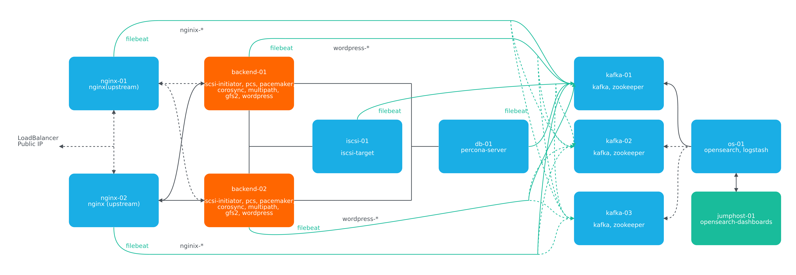

Для начала получаем OAUTH токен:
```
https://cloud.yandex.ru/docs/iam/concepts/authorization/oauth-token
```

Настраиваем аутентификации в консоли:
```
export YC_TOKEN=$(yc iam create-token)
export TF_VAR_yc_token=$YC_TOKEN
```

В файле provider.tf нужно вставить свой 'cloud_id':
```
cloud_id  = "..."
```

При необходимости в файле main.tf вставить нужные 'ssh_public_key' и 'ssh_private_key', так как по умолчанию соответсвенно id_rsa.pub и id_rsa:
```
ssh_public_key  = "~/.ssh/id_rsa.pub"
ssh_private_key = "~/.ssh/id_rsa"
```

Для того чтобы развернуть стенд, нужно выполнить следующую команду, вставляя свои значения (пароли) для переменных admin_password, kibanaserver_password, logstash_password:
```
terraform init && terraform apply -auto-approve && \
sleep 60 && ansible-playbook ./provision.yml \
--extra-vars "admin_password=admin@Otus1234 \
kibanaserver_password=kibana@Otus1234 \
logstash_password=logstash@Otus1234"
```

По завершению команды получим данные outputs:
```
Outputs:

backend-servers-info = {
  "backend-01" = {
    "ip_address" = tolist([
      "10.10.10.8",
    ])
    "nat_ip_address" = tolist([
      "",
    ])
  }
  "backend-02" = {
    "ip_address" = tolist([
      "10.10.10.17",
    ])
    "nat_ip_address" = tolist([
      "",
    ])
  }
}
db-servers-info = {
  "db-01" = {
    "ip_address" = tolist([
      "10.10.10.12",
    ])
    "nat_ip_address" = tolist([
      "",
    ])
  }
}
iscsi-servers-info = {
  "iscsi-01" = {
    "ip_address" = tolist([
      "10.10.10.10",
    ])
    "nat_ip_address" = tolist([
      "",
    ])
  }
}
jump-servers-info = {
  "jump-01" = {
    "ip_address" = tolist([
      "10.10.10.32",
    ])
    "nat_ip_address" = tolist([
      "130.193.54.152",
    ])
  }
}
kafka-servers-info = {
  "kafka-01" = {
    "ip_address" = tolist([
      "10.10.10.35",
    ])
    "nat_ip_address" = tolist([
      "",
    ])
  }
  "kafka-02" = {
    "ip_address" = tolist([
      "10.10.10.28",
    ])
    "nat_ip_address" = tolist([
      "",
    ])
  }
  "kafka-03" = {
    "ip_address" = tolist([
      "10.10.10.18",
    ])
    "nat_ip_address" = tolist([
      "",
    ])
  }
}
loadbalancer-info = [
  {
    "attached_target_group" = toset([
      {
        "healthcheck" = tolist([
          {
            "healthy_threshold" = 2
            "http_options" = tolist([])
            "interval" = 2
            "name" = "tcp"
            "tcp_options" = tolist([
              {
                "port" = 5601
              },
            ])
            "timeout" = 1
            "unhealthy_threshold" = 2
          },
        ])
        "target_group_id" = "enpqeq02jj22kv80glct"
      },
      {
        "healthcheck" = tolist([
          {
            "healthy_threshold" = 2
            "http_options" = tolist([])
            "interval" = 2
            "name" = "tcp"
            "tcp_options" = tolist([
              {
                "port" = 80
              },
            ])
            "timeout" = 1
            "unhealthy_threshold" = 2
          },
        ])
        "target_group_id" = "enpsne51btdbs8b4tl63"
      },
    ])
    "created_at" = "2024-10-22T07:38:43Z"
    "deletion_protection" = false
    "description" = ""
    "folder_id" = "b1gf8fl8pqdm542r8cuu"
    "id" = "enp7iugr8f8ka5flg3il"
    "labels" = tomap({})
    "listener" = toset([
      {
        "external_address_spec" = toset([
          {
            "address" = "130.193.35.94"
            "ip_version" = "ipv4"
          },
        ])
        "internal_address_spec" = toset([])
        "name" = "dashboards-listener"
        "port" = 5601
        "protocol" = "tcp"
        "target_port" = 5601
      },
      {
        "external_address_spec" = toset([
          {
            "address" = "130.193.35.94"
            "ip_version" = "ipv4"
          },
        ])
        "internal_address_spec" = toset([])
        "name" = "webservers-listener"
        "port" = 80
        "protocol" = "tcp"
        "target_port" = 80
      },
    ])
    "name" = "mylb"
    "network_load_balancer_id" = "enp7iugr8f8ka5flg3il"
    "region_id" = "ru-central1"
    "type" = "external"
  },
]
nginx-servers-info = {
  "nginx-01" = {
    "ip_address" = tolist([
      "10.10.10.21",
    ])
    "nat_ip_address" = tolist([
      "",
    ])
  }
  "nginx-02" = {
    "ip_address" = tolist([
      "10.10.10.27",
    ])
    "nat_ip_address" = tolist([
      "",
    ])
  }
}
os-servers-info = {
  "os-01" = {
    "ip_address" = tolist([
      "10.10.10.7",
    ])
    "nat_ip_address" = tolist([
      "",
    ])
  }
}
```

На всех серверах будут установлены ОС Almalinux 8, настроены смнхронизация времени Chrony, система принудительного контроля доступа SELinux, в качестве firewall будет использоваться NFTables.

Кафку развернём на кластере из трёх нод kafka-01, kafka-02, kafka-03. Координатором в целях выбора лидера в кластере kafka будет осущетсвляться ZooKeeper.

Для централизованного сбора логов со всех серверов данного стенда создадим воспользуемся OpenSearch, установленный и настроенный на сервере os-01. 
В нашем проекте kafka будет собирать логи с балансировщиков (nginx-01 и nginx-02) и бэкендов (backend-01 и backend-02), где будут установлены WordPress, хранить у себя и будет передавать эти логи OpenSearch через Logstash на сервере os-01.

Для визуализации данных логов будем использовать OpenSearch Dashboard. В данном стенде OpenSearch Dashboard для удобства будем устанавливать на сервер Jump-01.

Для установки OpenSearch и OpenSearch Dashboard был склонирован из репозитория https://github.com/opensearch-project/ansible-playbook с внесением небольших изменений под свой проект.

В качестве агентов на серверах, откуда будем собирать логи, будем использовать FileBeat.

Так как на YandexCloud ограничено количество выделяемых публичных IP адресов, в дополнение к этому стенду создадим ещё один сервер jump-01 в качестве JumpHost, через который будем подключаться по SSH (в частности для Ansible) к другим серверам той же подсети.

Список виртуальных машин после запуска стенда:
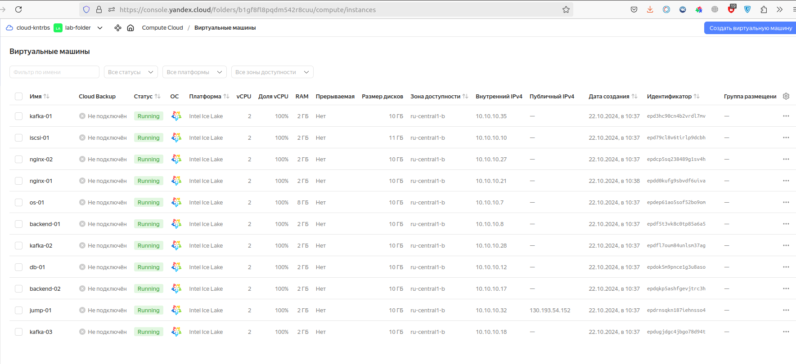


Для проверки работы стенда воспользуемся установленным на бэкендах Wordpress:
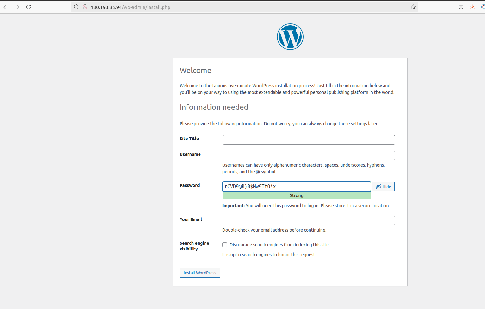


Значение IP адреса сайта получен от балансировщика от YandexCloud:
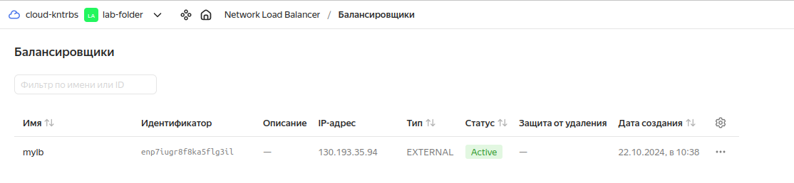


Страница OpenSearch Dashboard открывается в браузере, вводя в адресную строку публичный IP адрес балансировщика от YandexCloud с портом 5601:
```
http://130.193.54.152:5601
```
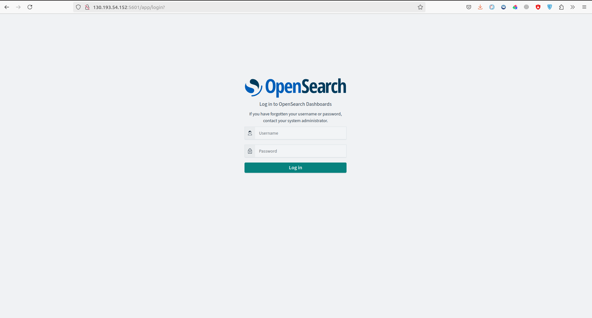

Вводим логин и пароль и кликаем по кнопке "Log In"
Стартовая страница:
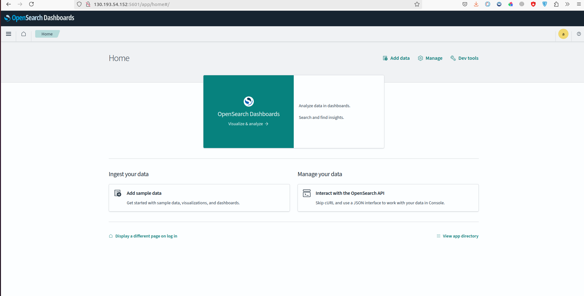

Кликаем "Главное меню", в секции "Management" выбираем "Dashboards Management"
Кликаем по ссылке "Index patterns"
Далее нажимаем по кнопке "Create index pattern":
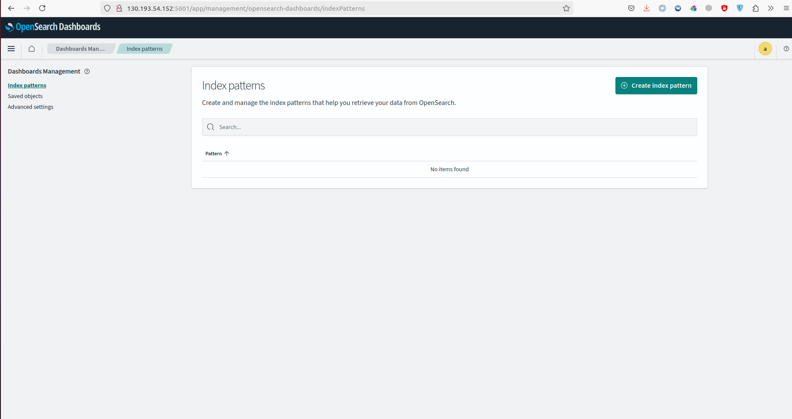

В поле "Index pattern name" вводим "nginx-*" и нажимаем "Next step >":

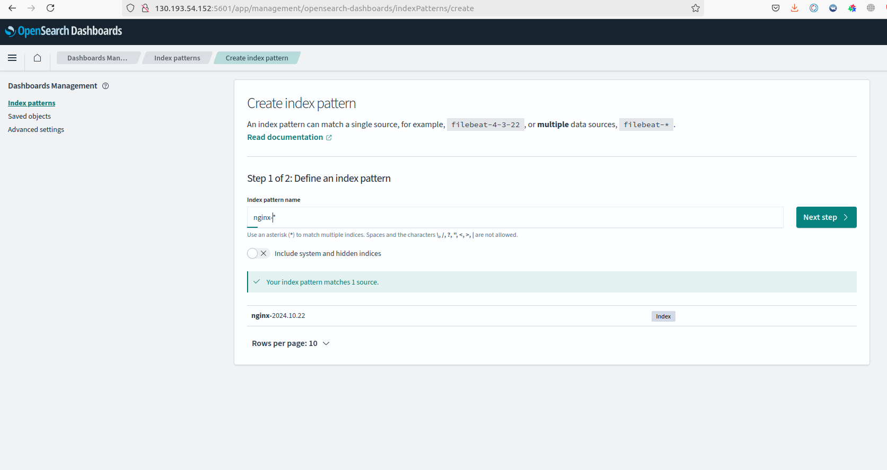

В следующем шаге в поле "Time field" выбираем "@timestamp" и нажимаем "Create index pattern":
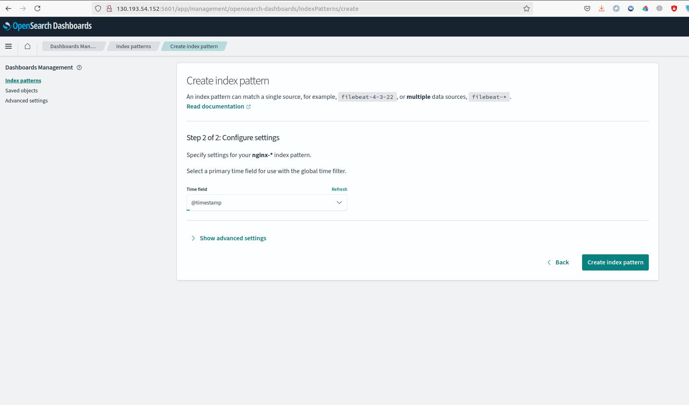
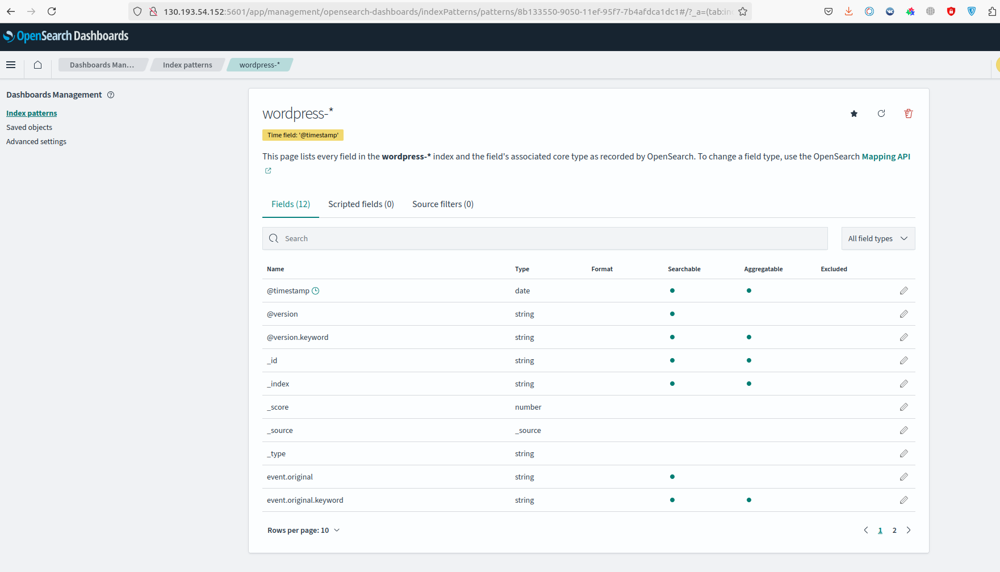
Таким же образом создадим для "wordpress-*"
В итоге получим:
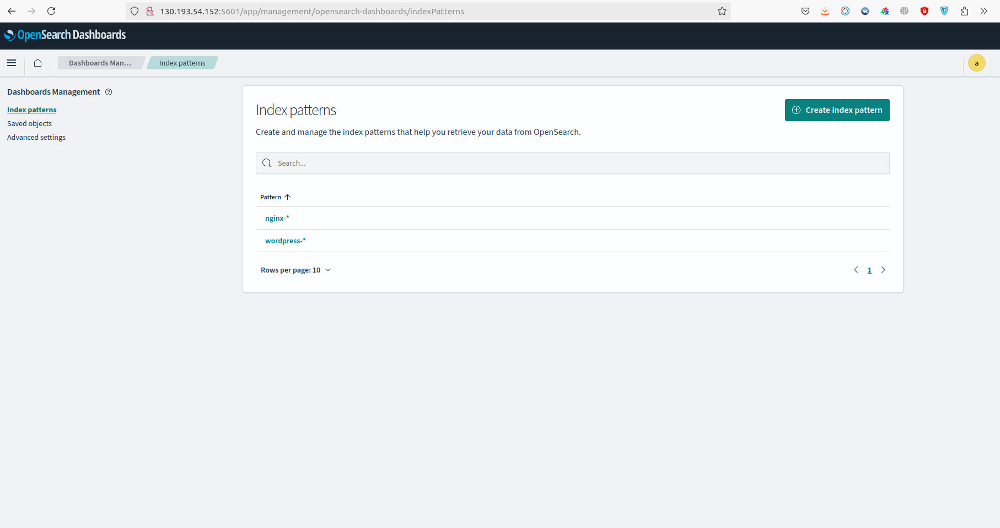

Далее заходим в "Главное меню", "Discover":
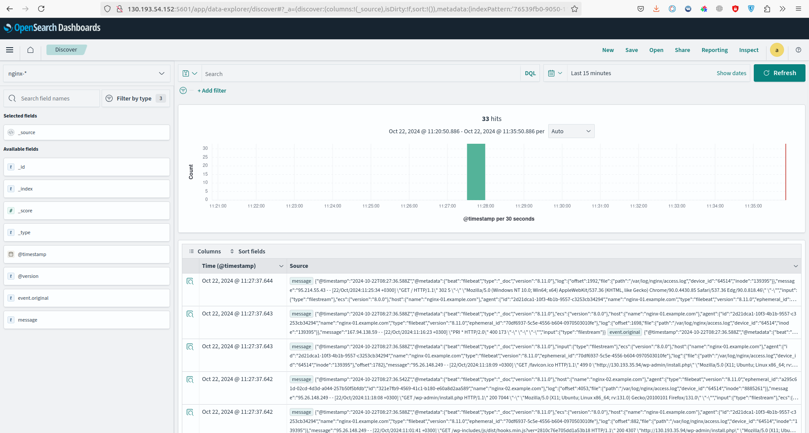

Выводится диаграмма с "nginx-*"
Выбираем "wordpress-*":

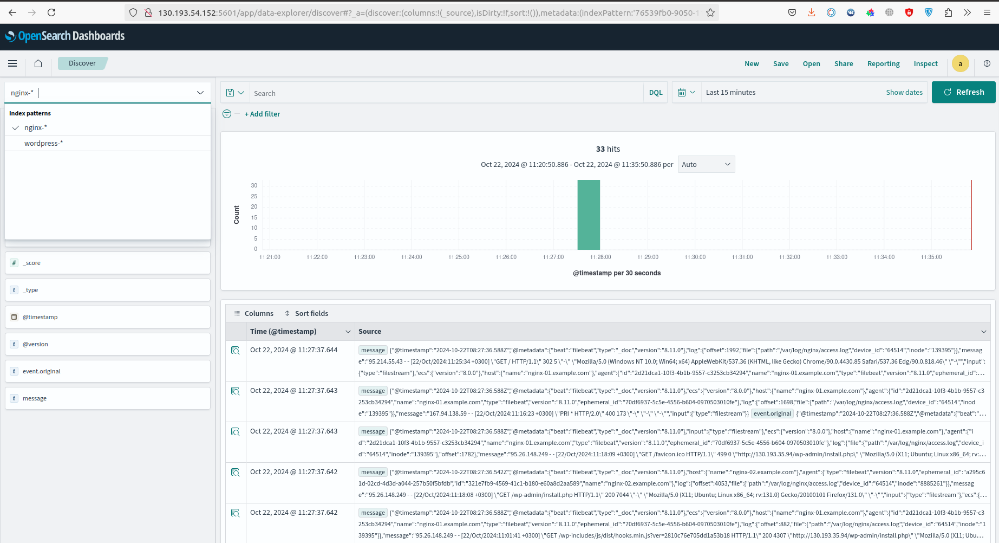
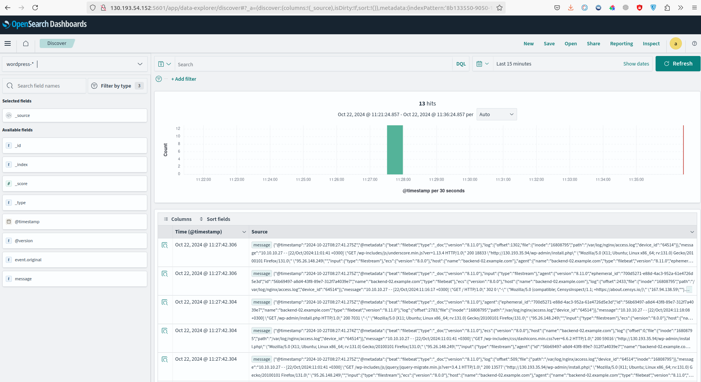

Для примера в адресной строке браузера WordPress введём, например:
```
158.160.130.226/otus123
```
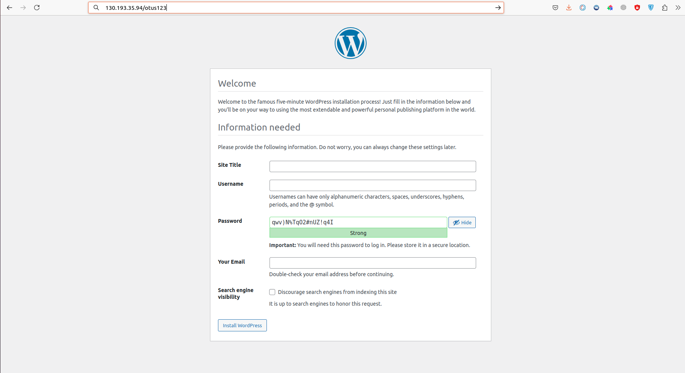

В поле "Search" введём значение "otus123" получим:
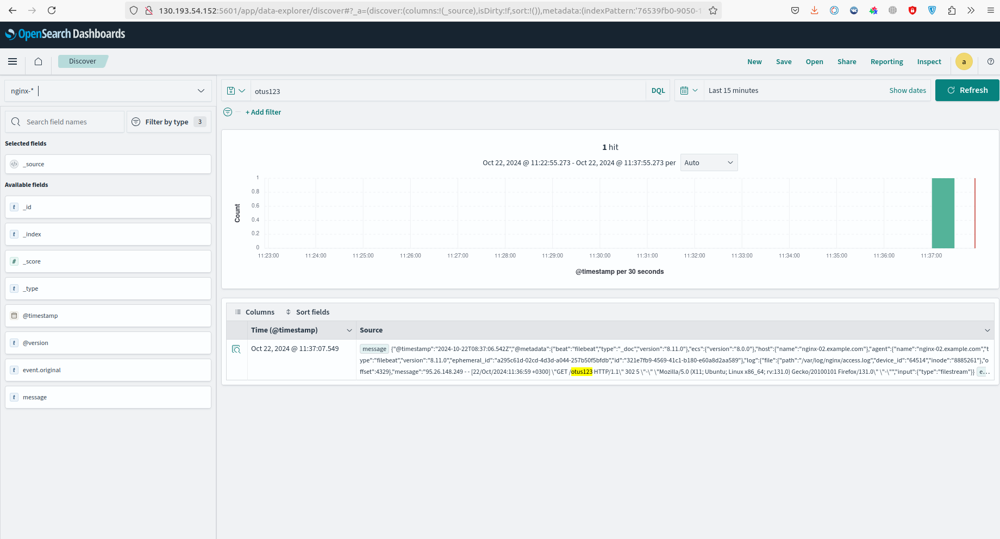


Подключимся по ssh к консоли одного из серверов кластера kafka, например, kafka-03
Зайдём в директорий kafka
Содержимое данной директории:
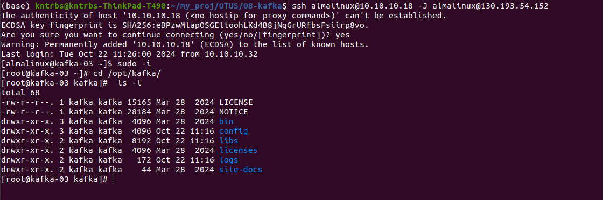

Список исполняющих файлов kafka:
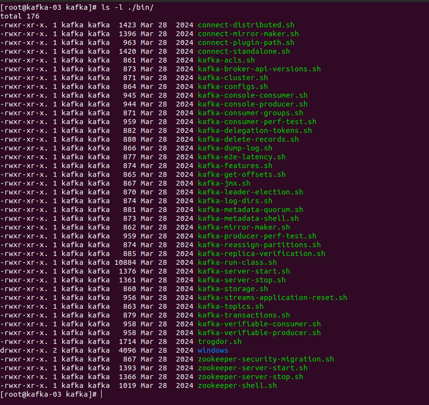
Детальный вывод по топикам "nginx" и "wordpress":
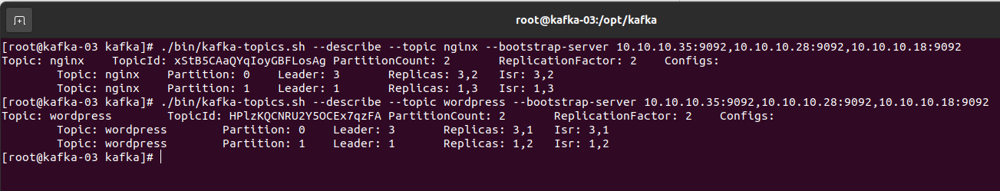
С помощью следующей команды после обновления страницы WordPress в браузере получаем следующие данные:
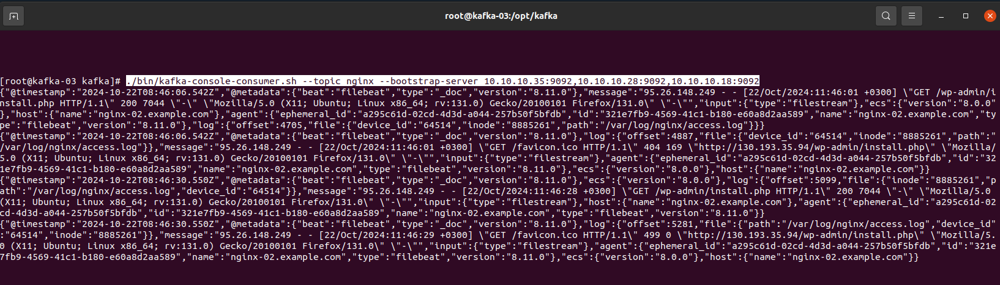
Можно делать вывод, что kafka кластер корректно функционирует, созданы два топика (nginx, wordpress), каждый имеет по две партиции и две реплики.


#### Удаление стенда

Удалить развернутый стенд командой:
```
terraform destroy -auto-approve
```
