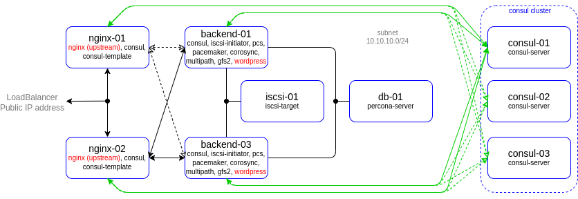
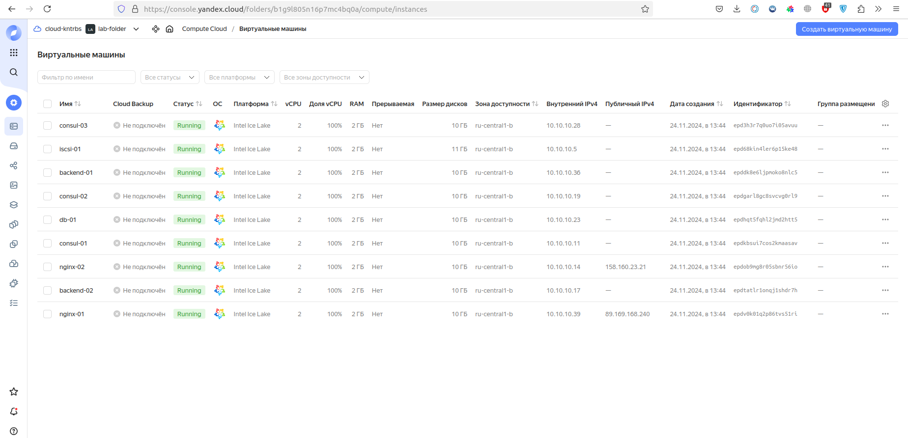
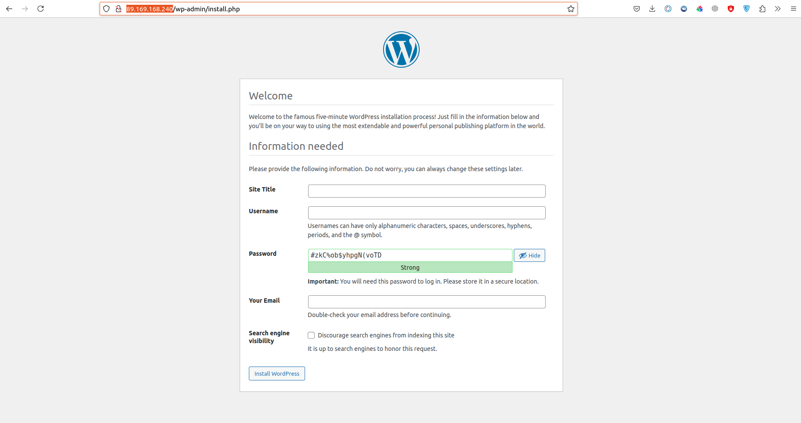
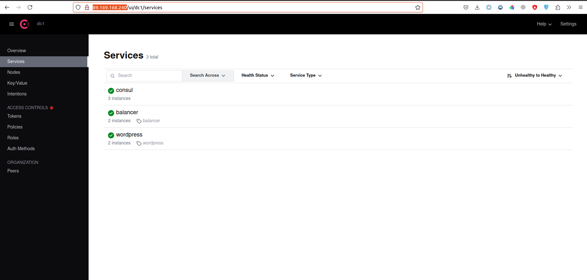
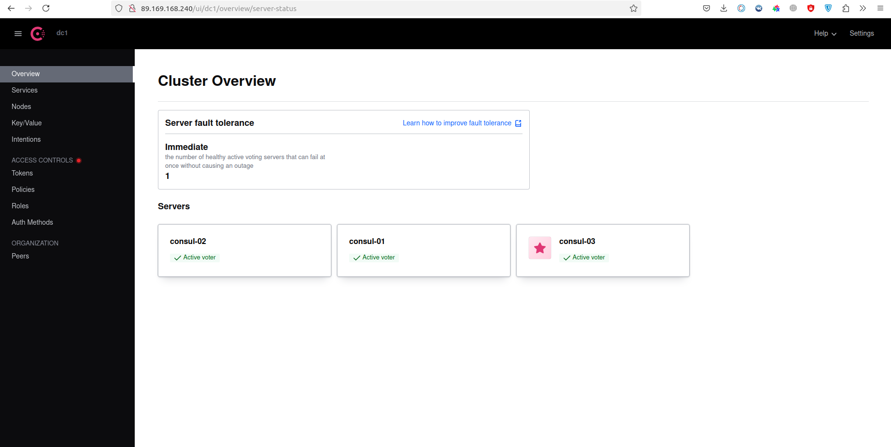
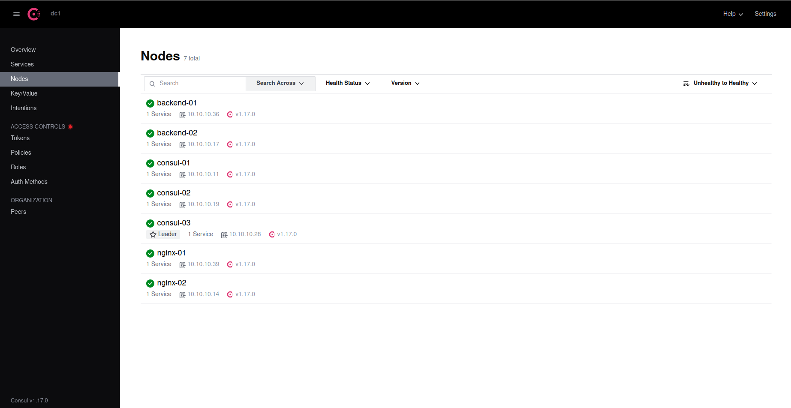

# lab-09
otus | consul

### Домашнее задание
Consul cluster для service discovery и DNS

#### Цель:
Реализовать consul cluster который выдает доменное имя для веб портала с прошлой ДЗ.
Плавающий IP заменить на балансировку через DNS.
В случае умирание одного из веб серверов IP должен убираться из DNS.

### Выполнение домашнего задания

#### Создание стенда

Стенд будем разворачивать с помощью Terraform на YandexCloud, настройку серверов будем выполнять с помощью Ansible.

Схема:



Для начала получаем OAUTH токен:
```
https://cloud.yandex.ru/docs/iam/concepts/authorization/oauth-token
```

Настраиваем аутентификации в консоли:
```
export YC_TOKEN=$(yc iam create-token)
export TF_VAR_yc_token=$YC_TOKEN
```
В файле input.auto.tfvars нужно вставить свой 'cloud_id':
```
cloud_id  = "..."
```

При необходимости в файле main.tf вставить нужные 'ssh_public_key' и 'ssh_private_key', так как по умолчанию соответсвенно id_rsa.pub и id_rsa:
```
ssh_public_key  = "~/.ssh/id_rsa.pub"
ssh_private_key = "~/.ssh/id_rsa"
```

Для того чтобы развернуть стенд, нужно выполнить следующую команду:
```
terraform init && terraform apply -auto-approve && \
sleep 180 && ansible-playbook ./provision.yml
```

По завершению команды получим данные outputs:
```
Outputs:

backend-servers-info = {
  "backend-01" = {
    "ip_address" = tolist([
      "10.10.10.36",
    ])
    "nat_ip_address" = tolist([
      "",
    ])
  }
  "backend-02" = {
    "ip_address" = tolist([
      "10.10.10.17",
    ])
    "nat_ip_address" = tolist([
      "",
    ])
  }
}
consul-servers-info = {
  "consul-01" = {
    "ip_address" = tolist([
      "10.10.10.11",
    ])
    "nat_ip_address" = tolist([
      "",
    ])
  }
  "consul-02" = {
    "ip_address" = tolist([
      "10.10.10.19",
    ])
    "nat_ip_address" = tolist([
      "",
    ])
  }
  "consul-03" = {
    "ip_address" = tolist([
      "10.10.10.28",
    ])
    "nat_ip_address" = tolist([
      "",
    ])
  }
}
db-servers-info = {
  "db-01" = {
    "ip_address" = tolist([
      "10.10.10.23",
    ])
    "nat_ip_address" = tolist([
      "",
    ])
  }
}
iscsi-servers-info = {
  "iscsi-01" = {
    "ip_address" = tolist([
      "10.10.10.5",
    ])
    "nat_ip_address" = tolist([
      "",
    ])
  }
}
jump-servers-info = {}
nginx-servers-info = {
  "nginx-01" = {
    "ip_address" = tolist([
      "10.10.10.39",
    ])
    "nat_ip_address" = tolist([
      "89.169.168.240",
    ])
  }
  "nginx-02" = {
    "ip_address" = tolist([
      "10.10.10.14",
    ])
    "nat_ip_address" = tolist([
      "158.160.23.21",
    ])
  }
}
```

На всех серверах будут установлены ОС Almalinux 8, настроены смнхронизация времени Chrony, система принудительного контроля доступа SELinux, в качестве firewall будет использоваться NFTables.

Consul-server развернём на кластере из трёх нод consul-01, consul-02, consul-03. На балансировщиках (nginx-01 и nginx-02) и бэкендах (backend-01 и backend-02) будут установлены клиентские версии Consul. На баланcировщиках также будут установлены и настроены сервис consul-template, которые будут динамически подменять конфигурационные файлы Nginx. На бэкендах будут установлены wordpress. Проверка (check) на доступность сервисов на клиентских серверах будет осуществляться по http.

Так как на YandexCloud ограничено количество выделяемых публичных IP адресов, в качестве JumpHost, через который будем подключаться по SSH (в частности для Ansible) к другим серверам той же подсети будем использовать сервер nginx-01.

Список виртуальных машин после запуска стенда:



Для проверки работы стенда воспользуемся установленным на бэкендах Wordpress:



Значение IP адреса сайта можно получить от одного из балансировщиков, например, nginx-01:


Страница Consul открывается в браузере, вводя в адресную строку выше указанный публичный IP адрес балансировщика nginx-01, добавив при этом в конце "ui":






В данном случае, как мы видим, лидером кластера consul является сервер consul-03.

Подключимся по sss к одному из серверов Consul, например, nginx-01:
```
ssh almalinux@89.169.168.240
```

Введём команду:
```
consul members
```

Получим:


Следующая команда выводит список зарегистрированных consul сервисов:
```
consul catalog services
```


DNS Зона прямого просмотра:


DNS Зона обратного просмотра:


Список серверов в домене balancer.service.consul:


Список серверов в домене wordpress.service.consul:


Вывод списка доступных серверов-балансировщиков в зоне balancer.service.dc1.consul, выполнив команду несколько раз подряд:


На сервере nginx-02 остановим сервис nginx:


Проверяем:


Список доступных и работающих серверов:


Как видим, работает consul сервис "balancer" на сервере nginx-01 с ip адресом 10.10.10.39.

В браузере выглядит следующим образом:


Включим nginx на сервере nginx-02:


Список агентов Consul сервиса:
```
[root@nginx-02 ~]# curl http://localhost:8500/v1/agent/members\?pretty
[
    {
        "Name": "backend-01",
        "Addr": "10.10.10.36",
        "Port": 8301,
        "Tags": {
            "build": "1.17.0:4e3f428b",
            "dc": "dc1",
            "id": "fc1e845b-0162-8b53-1e31-cc1825fd5021",
            "role": "node",
            "segment": "",
            "vsn": "2",
            "vsn_max": "3",
            "vsn_min": "2"
        },
        "Status": 1,
        "ProtocolMin": 1,
        "ProtocolMax": 5,
        "ProtocolCur": 2,
        "DelegateMin": 2,
        "DelegateMax": 5,
        "DelegateCur": 4
    },
    {
        "Name": "nginx-02",
        "Addr": "10.10.10.14",
        "Port": 8301,
        "Tags": {
            "build": "1.17.0:4e3f428b",
            "dc": "dc1",
            "id": "acb2332f-4675-c50e-2af5-048c02febfa4",
            "role": "node",
            "segment": "",
            "vsn": "2",
            "vsn_max": "3",
            "vsn_min": "2"
        },
        "Status": 1,
        "ProtocolMin": 1,
        "ProtocolMax": 5,
        "ProtocolCur": 2,
        "DelegateMin": 2,
        "DelegateMax": 5,
        "DelegateCur": 4
    },
    {
        "Name": "consul-01",
        "Addr": "10.10.10.11",
        "Port": 8301,
        "Tags": {
            "acls": "0",
            "build": "1.17.0:4e3f428b",
            "dc": "dc1",
            "expect": "3",
            "ft_fs": "1",
            "ft_si": "1",
            "grpc_tls_port": "8503",
            "id": "ab68e8cc-c3e7-8ed9-339b-faf4bf58f672",
            "port": "8300",
            "raft_vsn": "3",
            "role": "consul",
            "segment": "",
            "vsn": "2",
            "vsn_max": "3",
            "vsn_min": "2",
            "wan_join_port": "8302"
        },
        "Status": 1,
        "ProtocolMin": 1,
        "ProtocolMax": 5,
        "ProtocolCur": 2,
        "DelegateMin": 2,
        "DelegateMax": 5,
        "DelegateCur": 4
    },
    {
        "Name": "nginx-01",
        "Addr": "10.10.10.39",
        "Port": 8301,
        "Tags": {
            "build": "1.17.0:4e3f428b",
            "dc": "dc1",
            "id": "29d8e0f1-8f85-6454-df03-3f7d120e367a",
            "role": "node",
            "segment": "",
            "vsn": "2",
            "vsn_max": "3",
            "vsn_min": "2"
        },
        "Status": 1,
        "ProtocolMin": 1,
        "ProtocolMax": 5,
        "ProtocolCur": 2,
        "DelegateMin": 2,
        "DelegateMax": 5,
        "DelegateCur": 4
    },
    {
        "Name": "consul-03",
        "Addr": "10.10.10.28",
        "Port": 8301,
        "Tags": {
            "acls": "0",
            "build": "1.17.0:4e3f428b",
            "dc": "dc1",
            "expect": "3",
            "ft_fs": "1",
            "ft_si": "1",
            "grpc_tls_port": "8503",
            "id": "bcdc444e-fb26-0c2f-b21c-9bfc77c6f037",
            "port": "8300",
            "raft_vsn": "3",
            "role": "consul",
            "segment": "",
            "vsn": "2",
            "vsn_max": "3",
            "vsn_min": "2",
            "wan_join_port": "8302"
        },
        "Status": 1,
        "ProtocolMin": 1,
        "ProtocolMax": 5,
        "ProtocolCur": 2,
        "DelegateMin": 2,
        "DelegateMax": 5,
        "DelegateCur": 4
    },
    {
        "Name": "consul-02",
        "Addr": "10.10.10.19",
        "Port": 8301,
        "Tags": {
            "acls": "0",
            "build": "1.17.0:4e3f428b",
            "dc": "dc1",
            "expect": "3",
            "ft_fs": "1",
            "ft_si": "1",
            "grpc_tls_port": "8503",
            "id": "5aea99c7-02b4-8260-1d3f-d34033c1ff23",
            "port": "8300",
            "raft_vsn": "3",
            "role": "consul",
            "segment": "",
            "vsn": "2",
            "vsn_max": "3",
            "vsn_min": "2",
            "wan_join_port": "8302"
        },
        "Status": 1,
        "ProtocolMin": 1,
        "ProtocolMax": 5,
        "ProtocolCur": 2,
        "DelegateMin": 2,
        "DelegateMax": 5,
        "DelegateCur": 4
    },
    {
        "Name": "backend-02",
        "Addr": "10.10.10.17",
        "Port": 8301,
        "Tags": {
            "build": "1.17.0:4e3f428b",
            "dc": "dc1",
            "id": "a9994f39-b127-a1b8-eab8-b0c412cde47d",
            "role": "node",
            "segment": "",
            "vsn": "2",
            "vsn_max": "3",
            "vsn_min": "2"
        },
        "Status": 1,
        "ProtocolMin": 1,
        "ProtocolMax": 5,
        "ProtocolCur": 2,
        "DelegateMin": 2,
        "DelegateMax": 5,
        "DelegateCur": 4
    }
]

```

Текущее состояние агента на сервере nginx-02:


Список запущенных consul сервисов на текущей ноде nginx-02:


В данном случае на сервере nginx-02 запущен сервис "balancer".

Список зарегистрированных сервисов:


Характеристики сервиса "balancer":
```
[root@nginx-02 ~]# curl http://localhost:8500/v1/catalog/service/balancer\?pretty
[
    {
        "ID": "29d8e0f1-8f85-6454-df03-3f7d120e367a",
        "Node": "nginx-01",
        "Address": "10.10.10.39",
        "Datacenter": "dc1",
        "TaggedAddresses": {
            "lan": "10.10.10.39",
            "lan_ipv4": "10.10.10.39",
            "wan": "10.10.10.39",
            "wan_ipv4": "10.10.10.39"
        },
        "NodeMeta": {
            "consul-network-segment": "",
            "consul-version": "1.17.0"
        },
        "ServiceKind": "",
        "ServiceID": "balancer",
        "ServiceName": "balancer",
        "ServiceTags": [
            "balancer"
        ],
        "ServiceAddress": "",
        "ServiceTaggedAddresses": {
            "wan": {
                "Address": "89.169.168.240",
                "Port": 80
            }
        },
        "ServiceWeights": {
            "Passing": 1,
            "Warning": 1
        },
        "ServiceMeta": {},
        "ServicePort": 80,
        "ServiceSocketPath": "",
        "ServiceEnableTagOverride": false,
        "ServiceProxy": {
            "Mode": "",
            "MeshGateway": {},
            "Expose": {}
        },
        "ServiceConnect": {},
        "ServiceLocality": null,
        "CreateIndex": 37,
        "ModifyIndex": 37
    },
    {
        "ID": "acb2332f-4675-c50e-2af5-048c02febfa4",
        "Node": "nginx-02",
        "Address": "10.10.10.14",
        "Datacenter": "dc1",
        "TaggedAddresses": {
            "lan": "10.10.10.14",
            "lan_ipv4": "10.10.10.14",
            "wan": "10.10.10.14",
            "wan_ipv4": "10.10.10.14"
        },
        "NodeMeta": {
            "consul-network-segment": "",
            "consul-version": "1.17.0"
        },
        "ServiceKind": "",
        "ServiceID": "balancer",
        "ServiceName": "balancer",
        "ServiceTags": [
            "balancer"
        ],
        "ServiceAddress": "",
        "ServiceTaggedAddresses": {
            "wan": {
                "Address": "158.160.23.21",
                "Port": 80
            }
        },
        "ServiceWeights": {
            "Passing": 1,
            "Warning": 1
        },
        "ServiceMeta": {},
        "ServicePort": 80,
        "ServiceSocketPath": "",
        "ServiceEnableTagOverride": false,
        "ServiceProxy": {
            "Mode": "",
            "MeshGateway": {},
            "Expose": {}
        },
        "ServiceConnect": {},
        "ServiceLocality": null,
        "CreateIndex": 175,
        "ModifyIndex": 175
    }
]

```

Характеристики сервиса "wordpress":
```
[root@nginx-02 ~]# curl http://localhost:8500/v1/catalog/service/wordpress\?pretty
[
    {
        "ID": "fc1e845b-0162-8b53-1e31-cc1825fd5021",
        "Node": "backend-01",
        "Address": "10.10.10.36",
        "Datacenter": "dc1",
        "TaggedAddresses": {
            "lan": "10.10.10.36",
            "lan_ipv4": "10.10.10.36",
            "wan": "10.10.10.36",
            "wan_ipv4": "10.10.10.36"
        },
        "NodeMeta": {
            "consul-network-segment": "",
            "consul-version": "1.17.0"
        },
        "ServiceKind": "",
        "ServiceID": "wordpress",
        "ServiceName": "wordpress",
        "ServiceTags": [
            "wordpress"
        ],
        "ServiceAddress": "",
        "ServiceWeights": {
            "Passing": 1,
            "Warning": 1
        },
        "ServiceMeta": {},
        "ServicePort": 80,
        "ServiceSocketPath": "",
        "ServiceEnableTagOverride": false,
        "ServiceProxy": {
            "Mode": "",
            "MeshGateway": {},
            "Expose": {}
        },
        "ServiceConnect": {},
        "ServiceLocality": null,
        "CreateIndex": 162,
        "ModifyIndex": 162
    },
    {
        "ID": "a9994f39-b127-a1b8-eab8-b0c412cde47d",
        "Node": "backend-02",
        "Address": "10.10.10.17",
        "Datacenter": "dc1",
        "TaggedAddresses": {
            "lan": "10.10.10.17",
            "lan_ipv4": "10.10.10.17",
            "wan": "10.10.10.17",
            "wan_ipv4": "10.10.10.17"
        },
        "NodeMeta": {
            "consul-network-segment": "",
            "consul-version": "1.17.0"
        },
        "ServiceKind": "",
        "ServiceID": "wordpress",
        "ServiceName": "wordpress",
        "ServiceTags": [
            "wordpress"
        ],
        "ServiceAddress": "",
        "ServiceWeights": {
            "Passing": 1,
            "Warning": 1
        },
        "ServiceMeta": {},
        "ServicePort": 80,
        "ServiceSocketPath": "",
        "ServiceEnableTagOverride": false,
        "ServiceProxy": {
            "Mode": "",
            "MeshGateway": {},
            "Expose": {}
        },
        "ServiceConnect": {},
        "ServiceLocality": null,
        "CreateIndex": 160,
        "ModifyIndex": 160
    }
]
```

Работа с базой данных Consul через HTTP API:

Добавим ключ "nginx/config/workers" со значением, например, число "12345":
```
[root@nginx-02 ~]# curl -XPUT http://localhost:8500/v1/kv/nginx/config/workers -d 12345
true
```
Получить значение по ключу "nginx/config/workers":
```
[root@nginx-02 ~]# curl -XGET http://localhost:8500/v1/kv/nginx/config/workers
[{"LockIndex":0,"Key":"nginx/config/workers","Flags":0,"Value":"MTIzNDU=","CreateIndex":368,"ModifyIndex":368}]
```
или более наглядно:
```
[root@nginx-02 ~]# curl -XGET http://localhost:8500/v1/kv/nginx/config/workers\?pretty
[
    {
        "LockIndex": 0,
        "Key": "nginx/config/workers",
        "Flags": 0,
        "Value": "MTIzNDU=",
        "CreateIndex": 368,
        "ModifyIndex": 368
    }
]
```

В браузере:


Удалить ключ "nginx/config/workers":
```
[root@nginx-02 ~]# curl -XDELETE http://localhost:8500/v1/kv/nginx/config/workers
true
```

Работать с базой данных можно и с помощью команды Consul.

Добавить ключ "nginx/config/workers" со значением "15":
```
[root@nginx-02 ~]# consul kv put nginx/config/workers 15
Success! Data written to: nginx/config/workers
```

Получить значение:
```
[root@nginx-02 ~]# consul kv get nginx/config/workers
15
```

Удалить ключ "nginx/config/workers":
```
[root@nginx-02 ~]# consul kv delete nginx/config/workers
Success! Deleted key: nginx/config/workers
```

Конфигурационный файл nginx, который постоянно генерируется с помощью сервиса consul-template:


Подключимся по ssh к серверу backend-01:
Отключим nginx:


Снова смотрим конфигурационный файл nginx на балансировщике nginx-02:


Как видим, nginx сервис на балансировшике теперь направляет пакеты только на работающий backend-02.

Снова  включим nginx на backend-01:


Снова проверим конфигурационный файл nginx на балансировщике nginx-02:


Теперь пакеты снова направляются на оба бэкенда (backend-01 и backend-02).

Можно сделать вывод, что развёрнутая система с установленным и настроенным consul сервисом работает должным образом.


#### Удаление стенда

Удалить развернутый стенд командой:
```
terraform destroy -auto-approve
```


