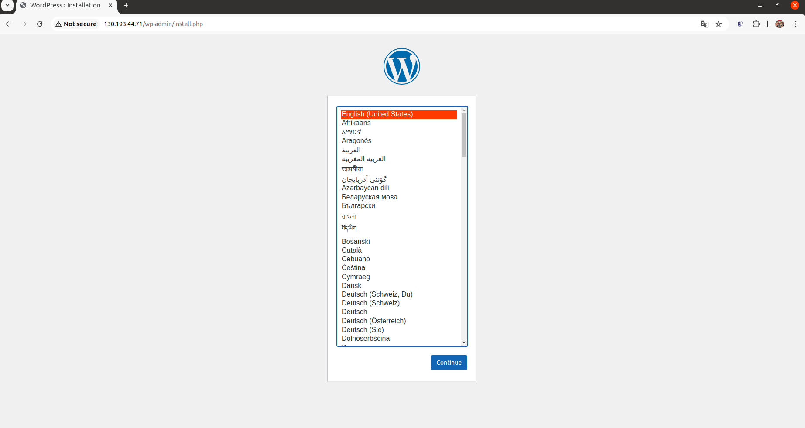

# lab-12
otus | kubernetes

### Домашнее задание
деплой в k8s

#### Цель:
инсталляция k8s на виртуальные машины и скрипты автоматического деплоя конфигурации кластера веб портала из предыдущих занятий в k8s
бэкап конфигурации кластера

### Выполнение домашнего задания

#### Создание стенда

Стенд будем разворачивать с помощью Terraform на YandexCloud, настройку серверов будем выполнять с помощью Kubernetes.

Для начала получаем OAUTH токен:
```
https://cloud.yandex.ru/docs/iam/concepts/authorization/oauth-token
```

Настраиваем аутентификации в консоли:
```
export YC_TOKEN=$(yc iam create-token)
export TF_VAR_yc_token=$YC_TOKEN
```

В файле input.auto.tfvars нужно вставить свой 'cloud_id':
```
cloud_id  = "..."
```

Kubernetes кластер будем разворачивать с помощью Terraform, а все установки и настройки необходимых приложений будем реализовывать с помощью команд kubectl и helm.

Установка kubectl с помощью стороннего пакетного менеджера:
```
snap install kubectl --classic
```

Установка helm:
```
curl -LO https://get.helm.sh/helm-v3.16.3-linux-amd64.tar.gz
tar -xf ./helm-v3.16.3-linux-amd64.tar.gz
sudo mv ./linux-amd64/helm /usr/local/bin/
rm -rf ./helm-v3.16.3-linux-amd64.tar.gz ./linux-amd64/
```

Для того чтобы развернуть kubernetes кластер, нужно выполнить следующую команду:
```
terraform init && terraform apply -auto-approve
```

В качестве балансировщика будем использовать Contour Ingress (https://projectcontour.io/):
```
kubectl apply -f https://projectcontour.io/quickstart/contour.yaml
```
```
kubectl get pods -n projectcontour -o wide

NAME                            READY   STATUS      RESTARTS   AGE   IP             NODE                        NOMINATED NODE   READINESS GATES
contour-678b9c6545-j772z        1/1     Running     0          23s   10.112.129.5   cl181g7f8qheapue6usv-aqow   <none>           <none>
contour-678b9c6545-l9shf        1/1     Running     0          23s   10.112.128.7   cl181g7f8qheapue6usv-otiv   <none>           <none>
contour-certgen-v1-30-1-7mfdk   0/1     Completed   0          24s   10.112.129.4   cl181g7f8qheapue6usv-aqow   <none>           <none>
envoy-6rbs8                     2/2     Running     0          23s   10.112.128.8   cl181g7f8qheapue6usv-otiv   <none>           <none>
envoy-rnxhh                     2/2     Running     0          23s   10.112.129.6   cl181g7f8qheapue6usv-aqow   <none>           <none>
```

Установим mysql:
```
helm upgrade --install mysql ./Charts/mysql/ -f ./Charts/values.yaml
```

Установим wordpress:
```
helm upgrade --install wordpress ./Charts/wordpress/ -f ./Charts/values.yaml
```

С помощью следующей команды:
```
kubectl describe ingress wordpress-ingress
```

получим публичный IP для доступа к веб-странице WordPress:
```
(base) kntrbs@kntrbs-ThinkPad-T490:~/my_proj/OTUS/12-k8s$ kubectl describe ingress wordpress-ingress
Name:             wordpress-ingress
Labels:           app=wordpress
                  app.kubernetes.io/managed-by=Helm
Namespace:        default
Address:          130.193.44.71
Ingress Class:    contour
Default backend:  <default>
Rules:
  Host        Path  Backends
  ----        ----  --------
  *           
              /   wordpress-svc:80 ()
Annotations:  meta.helm.sh/release-name: wordpress
              meta.helm.sh/release-namespace: default
Events:       <none>

```

Полученный IP адрес вводим в адресной строке браузера, получим стартовую веб-страницу Wordpress:



Можно сделать вывод, что развёрнутый kubernetes кластер работает должным образом.


Информация о kubernetes кластере k8s-lab:
```
(base) kntrbs@kntrbs-ThinkPad-T490:~/my_proj/OTUS/12-k8s$ kubectl cluster-info
Kubernetes control plane is running at https://51.250.110.129
CoreDNS is running at https://51.250.110.129/api/v1/namespaces/kube-system/services/kube-dns:dns/proxy

To further debug and diagnose cluster problems, use 'kubectl cluster-info dump'.

```
```
[(base) kntrbs@kntrbs-ThinkPad-T490:~/my_proj/OTUS/12-k8s$ yc managed-kubernetes cluster list --folder-name labfolder
+----------------------+---------+---------------------+---------+---------+------------------------+-------------------+
|          ID          |  NAME   |     CREATED AT      | HEALTH  | STATUS  |   EXTERNAL ENDPOINT    | INTERNAL ENDPOINT |
+----------------------+---------+---------------------+---------+---------+------------------------+-------------------+
| catv1us9b2f0r66u8nsp | k8s-lab | 2024-12-01 11:19:12 | HEALTHY | RUNNING | https://51.250.110.129 | https://10.1.0.23 |
+----------------------+---------+---------------------+---------+---------+------------------------+-------------------+

```

Информация о нодах kubernetes кластера:
```
(base) kntrbs@kntrbs-ThinkPad-T490:~/my_proj/OTUS/12-k8s$ kubectl get nodes -o wide
NAME                        STATUS   ROLES    AGE     VERSION   INTERNAL-IP   EXTERNAL-IP   OS-IMAGE             KERNEL-VERSION      CONTAINER-RUNTIME
cl181g7f8qheapue6usv-aqow   Ready    <none>   7m58s   v1.30.1   10.1.0.15     <none>        Ubuntu 20.04.6 LTS   5.4.0-187-generic   containerd://1.6.28
cl181g7f8qheapue6usv-otiv   Ready    <none>   8m8s    v1.30.1   10.1.0.12     <none>        Ubuntu 20.04.6 LTS   5.4.0-187-generic   containerd://1.6.28

```

Информация о группе безопасности:
```
(base) kntrbs@kntrbs-ThinkPad-T490:~/my_proj/OTUS/12-k8s$ yc vpc security-group get --name k8s-public-services --folder-name labfolder
id: enp7k8bl5um1726q2mt3
folder_id: b1gi0qti5i3fr1ihgpol
created_at: "2024-12-01T11:19:12Z"
name: k8s-public-services
description: Правила группы разрешают подключение к сервисам из интернета. Примените правила только для групп узлов.
network_id: enp0pfeekslkadn4a573
status: ACTIVE
rules:
  - id: enp04sp7iqgt6sub5mot
    description: Правило разрешает весь исходящий трафик. Узлы могут связаться с Yandex Container Registry, Yandex Object Storage, Docker Hub и т. д.
    direction: EGRESS
    ports:
      to_port: "65535"
    protocol_name: ANY
    protocol_number: "-1"
    cidr_blocks:
      v4_cidr_blocks:
        - 0.0.0.0/0
  - id: enppmcsnubmqndhhceq0
    description: Правило разрешает проверки доступности с диапазона адресов балансировщика нагрузки. Нужно для работы отказоустойчивого кластера Managed Service for Kubernetes и сервисов балансировщика.
    direction: INGRESS
    ports:
      to_port: "65535"
    protocol_name: TCP
    protocol_number: "6"
    predefined_target: loadbalancer_healthchecks
  - id: enpddmstgeanpo3rjlvo
    description: Правило разрешает входящий трафик из интернета на диапазон портов NodePort. Добавьте или измените порты на нужные вам.
    direction: INGRESS
    ports:
      from_port: "30000"
      to_port: "32767"
    protocol_name: TCP
    protocol_number: "6"
    cidr_blocks:
      v4_cidr_blocks:
        - 0.0.0.0/0
  - id: enpjp9vtlc659jtn15vv
    description: Правило разрешает взаимодействие под-под и сервис-сервис. Укажите подсети вашего кластера Managed Service for Kubernetes и сервисов.
    direction: INGRESS
    ports:
      to_port: "65535"
    protocol_name: ANY
    protocol_number: "-1"
    cidr_blocks:
      v4_cidr_blocks:
        - 10.1.0.0/16
  - id: enpps37ckcmr06i99i46
    description: Правило разрешает входящий трафик из интернета на 443 порт для доступа к веб-странице WordPress. Добавьте или измените порты на нужные вам.
    direction: INGRESS
    ports:
      from_port: "443"
      to_port: "443"
    protocol_name: ANY
    protocol_number: "-1"
    cidr_blocks:
      v4_cidr_blocks:
        - 0.0.0.0/0
  - id: enpfvh5cqn7iq3d51b21
    description: Правило разрешает взаимодействие мастер-узел и узел-узел внутри группы безопасности.
    direction: INGRESS
    ports:
      to_port: "65535"
    protocol_name: ANY
    protocol_number: "-1"
    predefined_target: self_security_group
  - id: enp6st74dj209t3o3ets
    description: Правило разрешает отладочные ICMP-пакеты из внутренних подсетей.
    direction: INGRESS
    protocol_name: ICMP
    protocol_number: "1"
    cidr_blocks:
      v4_cidr_blocks:
        - 10.0.0.0/8
        - 172.16.0.0/12
        - 192.168.0.0/16
  - id: enpsmrhpp4osqu923161
    description: Правило разрешает входящий трафик из интернета на 80 порт для доступа к веб-странице WordPress. Добавьте или измените порты на нужные вам.
    direction: INGRESS
    ports:
      from_port: "80"
      to_port: "80"
    protocol_name: ANY
    protocol_number: "-1"
    cidr_blocks:
      v4_cidr_blocks:
        - 0.0.0.0/0

```


#### Удаление стенда

Удалить развернутый стенд командой:
```
terraform destroy -auto-approve
```

